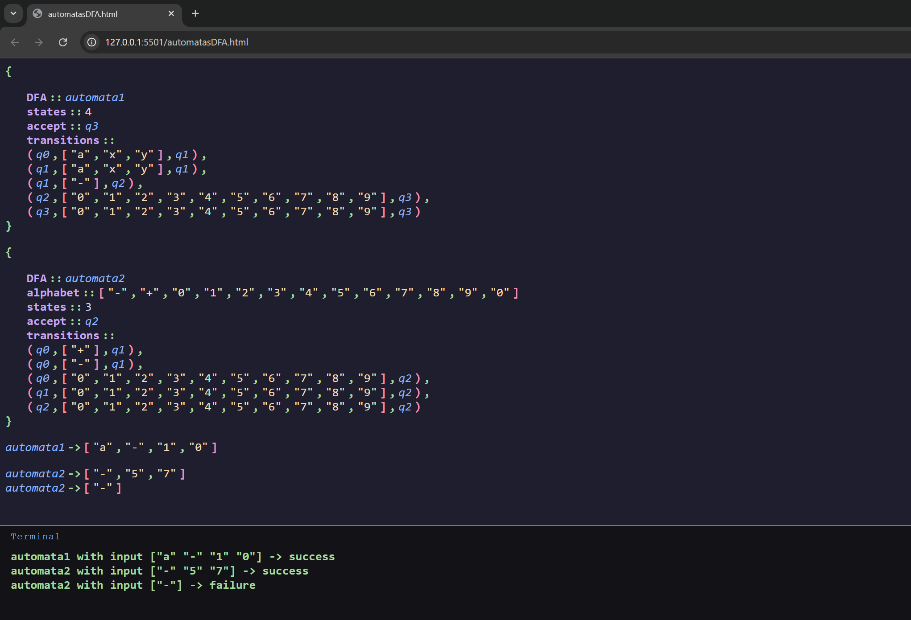

# Evidencia 1. Un lenguaje para definir autómatas

## Estructura del Proyecto

- `/`: Código principal.
- `testing_files/`: Archivos de prueba.
  - `imgs/`: Contiene imágenes utilizadas en las pruebas, como la mostrada arriba.